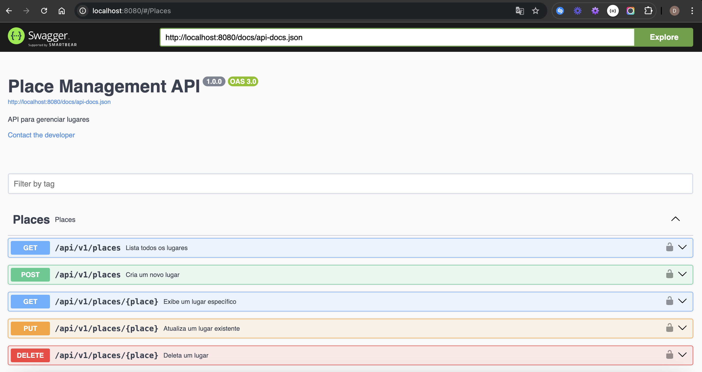

# Visão Geral

Este projeto é uma API desenvolvida em Laravel 10 para gerenciar "Places" (lugares). A aplicação permite criar, editar, listar e deletar lugares. O banco de dados utilizado é o PostgreSQL, e a aplicação está configurada para rodar em um ambiente Docker.

## Projeto Places

Este documento fornece instruções detalhadas sobre como configurar e executar o projeto **Places**.

## Pré-requisitos

Antes de começar, certifique-se de ter os seguintes programas instalados em sua máquina:

- [Git](https://git-scm.com/)
- [Docker](https://www.docker.com/)
- [Docker Compose](https://docs.docker.com/compose/)

## Tecnologias Envolvidas

- [Composer](https://getcomposer.org/)
- [PHP](https://www.php.net/)
- [Swagger](https://swagger.io/)
- [Git](https://git-scm.com/)
- [Docker](https://www.docker.com/)
- [PostgreSQL](https://www.postgresql.org/)
- [Docker Compose](https://docs.docker.com/compose/)

## Passos para Rodar a Aplicação

### 1. Clonar o Projeto do GitHub

1. Abra o terminal.
2. Navegue até o diretório onde você deseja clonar o projeto.
3. Execute o comando abaixo para clonar o repositório:

```sh
git clone https://github.com/Dumilson/api-places.git
```

### 2. Instalar as Dependências

Navegue até o diretório do projeto e instale as dependências do PHP usando o Composer:

```sh
cd api-places
```

### 3. Configurar as Chaves no .env

Renomeie o arquivo `.env.example` para `.env`:

```sh
cp .env.example .env
```

### 4. Configurar o Banco de Dados

Abra o arquivo `.env` e configure as seguintes variáveis de ambiente de acordo com seu servidor de banco de dados:

```dotenv
DB_CONNECTION=pgsql
DB_HOST=postgres (nome do container do banco de dados)
DB_PORT=5432
DB_DATABASE=places_db
DB_USERNAME=root
DB_PASSWORD=Kumesso19$
```

### 5. Configurar o Ambiente Docker

Execute os comandos abaixo para configurar o ambiente Docker do projeto:

1. Rodar o build do Dockerfile:

```sh
docker build .
```

2. Rodar e subir os containers Docker:

```sh
docker-compose up -d
```

### 6. Acessar o Container do Laravel

1. Use o comando `docker ps` para verificar o nome do container.
2. Acesse o terminal interativo do container Laravel:

```sh
docker-compose exec -it nome_container_da_imagem_paciente/laravel-app bash
```

3. Instale as dependências do Projecto usando o Composer

```sh
composer install
```

4. Gere uma chave de aplicativo Laravel:

```sh
php artisan key:generate
```

5. Execute as migrações para criar as tabelas no banco de dados:

```sh
php artisan migrate
```

Certifique-se de que o servidor do banco de dados está em execução e as credenciais configuradas no arquivo `.env` estão corretas.

### 7. Acessar a Aplicação em Ambiente de Teste

A aplicação estará disponível em [http://localhost:8080/](http://localhost:8080/).



## Processo de Deploy

O projeto está configurado para deploy automático usando GitHub Actions. O fluxo de trabalho é o seguinte:

1. Todas as atualizações devem ser feitas na branch `develop`.
2. Quando as alterações estiverem prontas para ir para produção, abra um Pull Request da branch `develop` para a branch `master`.
3. Quando o Pull Request for aprovado e mesclado na branch `master`, o GitHub Actions iniciará o processo de deploy automaticamente.

### Documentação da API em Produção

A documentação da API em produção está disponível em: [https://places.domingosbraganha.tech/](https://places.domingosbraganha.tech/)
